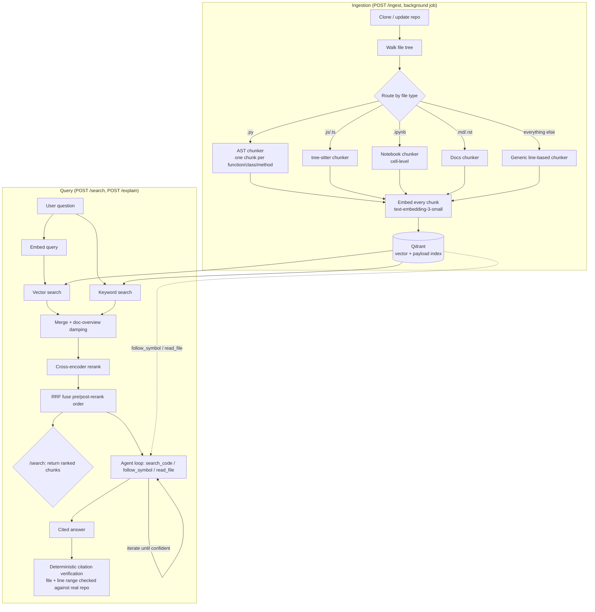

# CodeSeek

[](https://github.com/sathwikkotha/CodeSeek/actions/workflows/ci.yml)

Semantic code search over real repositories: point it at any public GitHub
repo, then ask it questions in plain English. An LLM agent searches the
codebase, follows symbol references, and reads source directly — the same
way a person would — before writing a **grounded, cited answer**, not just a
ranked list of matching snippets.

```
"How does this library represent a configuration option internally?"
  -> ArgumentInfo is defined in typer/models.py:142-168 [...]
     validated by validate_argument in typer/main.py:...
```

## Why this exists

Most "chat with your codebase" demos stop at "embed some chunks, cosine
similarity, done." CodeSeek exists to answer a harder question: **what does
it actually take to make that trustworthy and fast at real repo scale** —
where "trustworthy" means an answer with citations that are mechanically
verified against real files, and "real repo scale" means AST-aware chunking,
hybrid retrieval, and reranking measured and tuned against a real evaluation
harness, not tuned by feel.

Every non-obvious decision in this codebase is a comment explaining a
measured trade-off, not a guess — see [Evaluation & benchmarks](#evaluation--benchmarks)
below for the numbers those comments are backed by.

## Architecture



**Two entry points into the same indexed corpus:**
- `/search` — raw hybrid retrieval, for building your own UI or debugging ranking directly.
- `/explain` (and `/explain/stream`) — the full agentic loop: an LLM iteratively calls
  `search_code` / `follow_symbol` / `read_file` against the indexed repo, then writes an
  answer with `repo/path:start-end` citations, which are checked against the real
  filesystem before being trusted (see [`agent/verify.py`](src/codeseek/agent/verify.py)).

## What makes retrieval quality real, not assumed

- **AST-aware chunking, not fixed-size windows** — Python via `ast`, JS/TS via
  tree-sitter. A class becomes one overview chunk (signature, docstring, field
  declarations) plus one chunk *per method*, individually retrievable — see
  [`chunking/code_chunker.py`](src/codeseek/chunking/code_chunker.py).
- **Hybrid retrieval** — vector search alone misses exact identifiers
  (`JWTBearer`); keyword search alone misses semantic matches. Both run, and
  merge additively — a keyword hit never outranks or removes a genuine
  semantic match ([`retrieval/hybrid.py`](src/codeseek/retrieval/hybrid.py)).
- **Cross-encoder reranking, fused by rank (RRF), not trusted outright** — a
  reranker trained on prose (MS MARCO) is measurably biased toward READMEs
  over sparse-but-correct code chunks. Reciprocal Rank Fusion lets it
  influence the final order without being able to fully override a candidate
  that already scored strongly.
- **Doc-overview damping** — a README's first chunk is broad enough to score
  deceptively high against almost any question about that repo. Damping
  *only* that specific chunk (not every doc chunk) was measured to improve
  both code and doc-appropriate queries — see the ablation table below.
- **Deterministic citation verification** — every `file:line` citation the
  agent writes is checked against the real repo (file exists, line range in
  bounds) by plain code, not another LLM call — so the check itself can't hallucinate.
- **Real cost accounting** — cached vs. uncached input tokens are billed (and
  reported) separately, since every agent-loop iteration resends the full
  message history.

## Evaluation & benchmarks

Retrieval quality is measured against a fixed ground-truth set, not asserted.
Two reproducible experiments back the claims above:

- **[docs/eval_results.md](docs/eval_results.md)** — an ablation table:
  Recall@5/Recall@10/MRR at each retrieval stage (vector-only → + hybrid → +
  rerank → + RRF fusion), measured against questions about CodeSeek's own
  source. Reproduce: `python scripts/run_ablation.py`. The standout result:
  reranking *alone* drops MRR from 1.000 to 0.803 on this run — the exact
  failure mode RRF fusion exists to guard against — and fusion recovers it
  to 1.000, measured, not just argued.
- **[docs/scaling_results.md](docs/scaling_results.md)** — a load test:
  indexing throughput and query latency as the corpus grows across several
  real public repos, checking [`docs/scaling_design.md`](docs/scaling_design.md)'s
  reasoning against real numbers. Reproduce: `python scripts/load_test.py`.

The same ground-truth set ([`scripts/self_eval_ground_truth.json`](scripts/self_eval_ground_truth.json))
also runs as a **CI quality gate** on every push — see
[`.github/workflows/ci.yml`](.github/workflows/ci.yml) and
[`scripts/eval_gate.py`](scripts/eval_gate.py): a PR that regresses retrieval
below the committed baseline fails CI the same way a broken unit test would.

## Quickstart

### Docker Compose (fastest path — API + UI + Qdrant)

```bash
cp .env.example .env   # fill in OPENAI_API_KEY
docker compose up --build
```

- API: http://localhost:8000 (docs at `/docs`)
- UI: http://localhost:8501

### Local development

```bash
python -m venv .venv && source .venv/bin/activate   # .venv\Scripts\activate on Windows
pip install -e ".[dev]"
cp .env.example .env   # fill in OPENAI_API_KEY

uvicorn codeseek.api.main:app --reload        # terminal 1
streamlit run streamlit_app/app.py            # terminal 2
```

Or index one repo from the CLI without the UI:

```bash
python scripts/index_one.py https://github.com/psf/black.git
```

### Tests

```bash
pytest -q                 # fast suite: fakes only, no real models/services, ~10s
pytest -m slow -q         # also downloads/runs the real cross-encoder
ruff check src tests scripts streamlit_app
mypy src scripts
```

## API surface

| Route | Purpose |
|---|---|
| `POST /ingest` | Clone + index a repo; returns a job id immediately (background job, see below) |
| `GET /ingest/{job_id}` | Poll ingestion progress/result |
| `GET /repos` | List indexed repos with chunk counts |
| `DELETE /repos/{name}` | Remove a repo from the index |
| `POST /search` | Raw hybrid retrieval; returns ranked chunks + per-stage timings |
| `POST /explain` | Agentic, cited Q&A over one indexed repo |
| `POST /explain/stream` | Same, as Server-Sent Events (live tool-call + token streaming) |

Ingestion runs as a **background job** rather than blocking the request for
the full clone+chunk+embed duration (minutes, for a real repo) — see
[`api/jobs.py`](src/codeseek/api/jobs.py). The Streamlit UI polls it the same
way any other client should.

## Scaling beyond one machine

[`docs/scaling_design.md`](docs/scaling_design.md) covers sharding (by repo,
not by language or point-ID hash), repo-level access control (reusing the
existing metadata filter, not a new subsystem), and incremental re-indexing
via webhook (idempotent upserts via a deterministic point ID) — each argued
directly from decisions already in the code, then checked against real
numbers in [docs/scaling_results.md](docs/scaling_results.md).

## Project structure

```
src/codeseek/
  ingestion/    clone a repo, walk its file tree, route files by type
  chunking/     one chunker per file category (AST/tree-sitter/notebook/docs/generic)
  embedding/    the embedder interface + OpenAI implementation + query cache
  store/        Qdrant wrapper: collections, upsert, vector/keyword search
  retrieval/    hybrid merge, doc damping, cross-encoder rerank, RRF fusion
  agent/        the tool-calling explain loop + deterministic citation verification
  eval/         Recall@k / MRR harness against a ground-truth question set
  pipeline/     wires ingestion -> chunking -> embedding -> storage
  api/          FastAPI app: search, explain, ingest (background jobs)
  observability/ structured, timed JSON logging per pipeline stage
streamlit_app/  the UI: ask questions, run raw searches, index new repos
scripts/        CLI indexing, the CI eval gate, ablation + load-test benchmarks
tests/          unit + integration tests (fakes for OpenAI/Qdrant; no network needed)
docs/           scaling design + the benchmark reports above
```

## License

[MIT](LICENSE)
